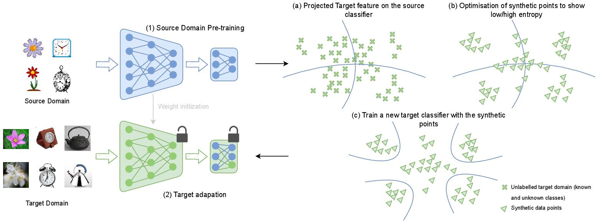

# Recall and Refine: A Simple but Effective Source-free Open-set Domain Adaptation Framework

## Introduction
In source-free open-set domain adaptation (SF-OSDA), the key challenge lies in adapting a pre-trained source model to a target domain containing both shared and unknown classes, without access to source data. We propose RRDA (Recall and Refine Domain Adaptation), a simple yet effective framework that enhances existing SF-OSDA methods. RRDA operates in two stages: (1) recall phase - identifying and leveraging high-confidence samples; (2) refine phase - improving classification boundaries through synthetic sample generation.

## Framework


## Prerequisites
- python3, pytorch, numpy, PIL, scipy, sklearn, tqdm, etc.
- We have presented the our conda environment file in `./environment.yml`.

## Dataset
We conduct extensive experiments on three standard domain adaptation benchmarks:
- Office
- OfficeHome
- VisDA

Please manually download these datasets from the official websites and unzip them to the `./data` folder. We have included as supplementary the Office dataset (only Amazon and Webcam available due to submission size constraints).

The data structure should look like:

```
./data
├── Office
│   ├── Amazon
│   │   └── ...
│   └── Webcam
│       └── ...
├── OfficeHome
│   └── ...
└── VisDA
   └── ...
```

### Step
1. Please prepare the environment first.
2. Please download the datasets from the corresponding official websites, and then unzip them to the `./data` folder.
3. Preparing the source model.
4. Performing the target model adaptation.

## Training

Open-set Domain Adaptation (OSDA) on Office, OfficeHome, and VisDA

```
# Source Model Preparing
bash ./scripts/train_source_OSDA.sh
#Target Model Adaptation using RRDA+SHOT
bash ./scripts/train_target_shot_rrda.sh
#Target Model Adaptation using RRDA+AaD
bash ./scripts/train_target_aad_rrda.sh
```
The code to run SHOT and AaD baseline is also available. 


## Project stucture: 
```
├── data/                  # Dataset folder
├── figures/               # Framework and result visualizations
├── scripts/              # Training scripts
│   ├── train_source_OSDA.sh
│   ├── train_target_shot_rrda.sh
│   └── train_target_aad_rrda.sh
├── environment.yml       # Conda environment file
└── README.md
```

## Citation
If you find our codebase helpful, please star our project and cite our paper:

```
@article{nejjar2024recall,
  title={Recall and Refine: A Simple but Effective Source-free Open-set Domain Adaptation Framework},
  author={Nejjar, Ismail and Dong, Hao and Fink, Olga},
  journal={arXiv preprint},
  year={2024}
}
```

## Acknowledgements 
The majority of this code has been adapted from the following papers:

```
@inproceedings{sanqing2024LEAD,
  title={LEAD: Learning Decomposition for Source-free Universal Domain Adaptation},
  author={Qu, Sanqing and Zou, Tianpei and He, Lianghua and Röhrbein, Florian and Knoll, Alois and Chen, Guang and Jiang, Changjun},
  booktitle={CVPR},
  year={2024},
}

@inproceedings{sanqing2023GLC,
  title={Upcycling Models under Domain and Category Shift},
  author={Qu, Sanqing and Zou, Tianpei and Röhrbein, Florian and Lu, Cewu and Chen, Guang and Tao, Dacheng and Jiang, Changjun},
  booktitle={CVPR},
  year={2023},
}
```

## Contact
- ismail.nejjar@epfl.ch
